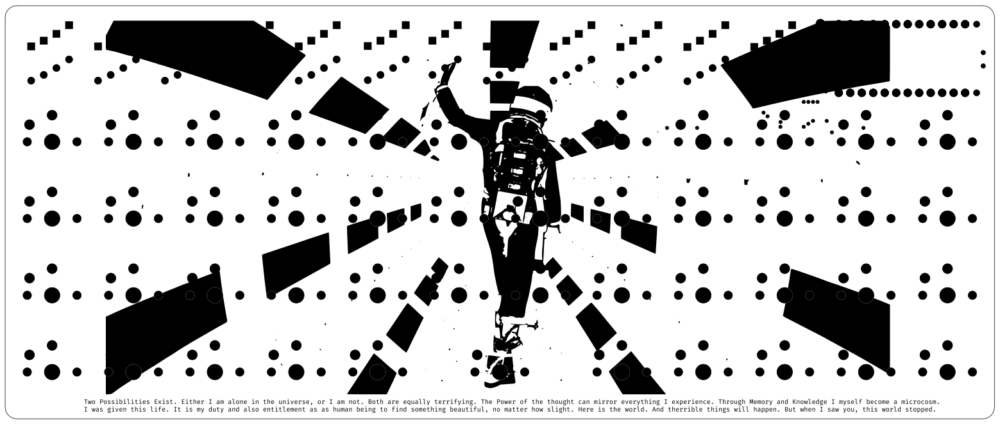

# keyboards

This repo contains PCBs, schematics, and [ZMK](https://zmk.dev) firmware configurations for the keyboards I built and used.

## corne36w

- Based on the [Corne by foostan](https://github.com/foostan/crkbd)
- Uses Choc swtich spacing and Nice!Nano footprint edits by [davidphilipbarr](https://github.com/davidphilipbarr/Choc-Spaced-Corne)
- Customised traces and silkscreen
- Firmware based mostly on [dxmh's configs](https://github.com/dxmh/zmk-config)

## Io

- A 47 wireless keyboard built from scratch
- Uses nice!nanoV2 MCU
- Low profile choc swiches, PCB mounted
- Inspired by OLKB Planck

## LPGalaxy Blank Slate

- Design by Pete Johanson
- Drop-in replacement PCB for OLKB Planck to add wireless functionality
- [Build Guide](https://docs.lpgala.xyz/docs/blank-slate-build-guide/overview/)
